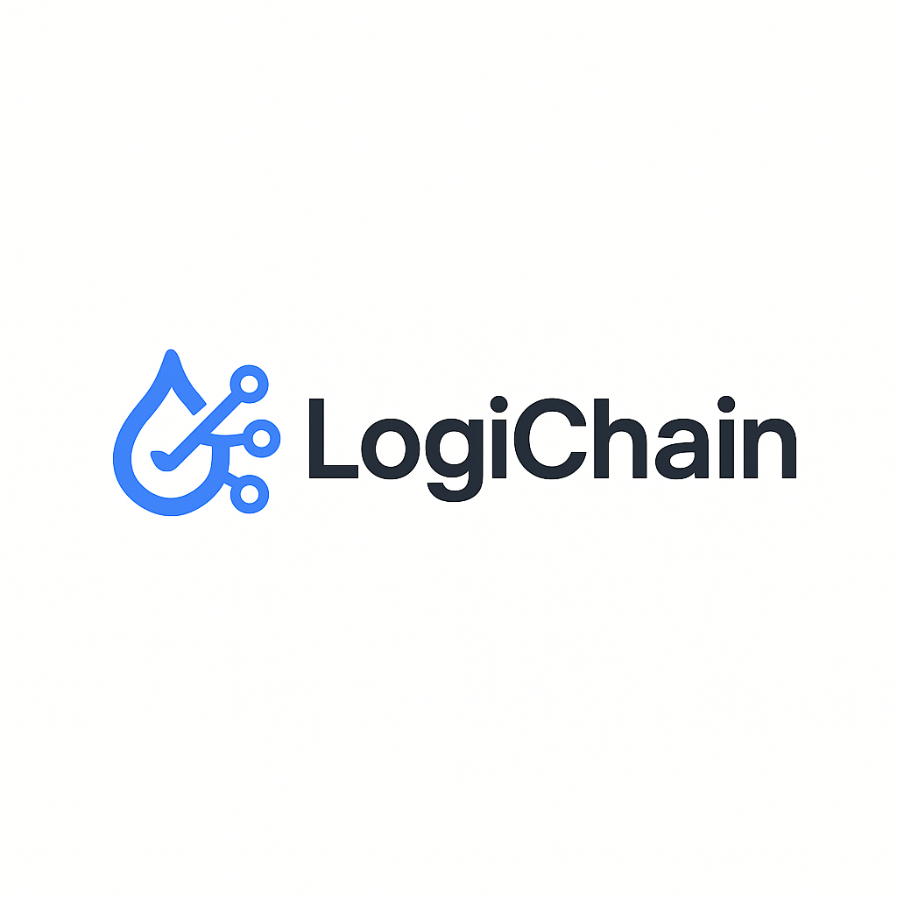
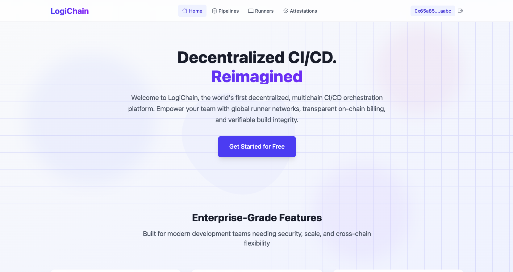
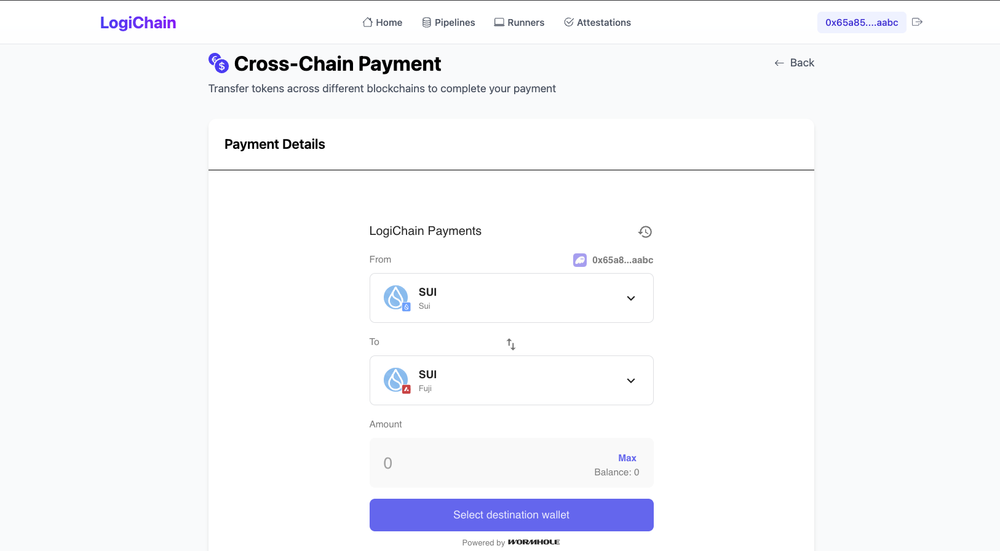
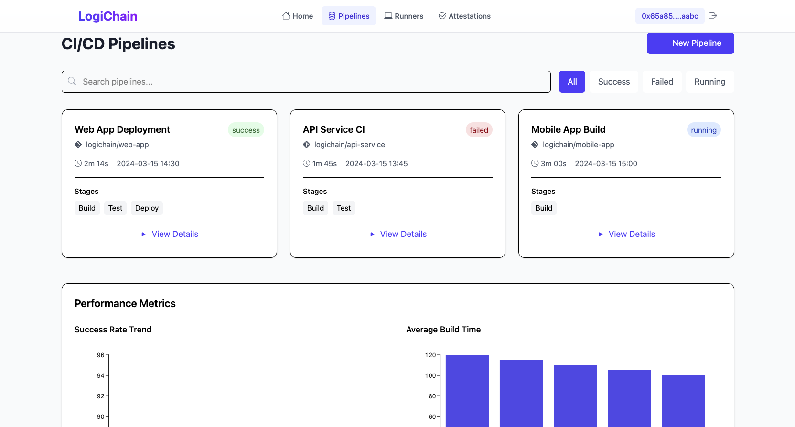

# LogiChain

<div align="center">
  
  <h3>Decentralized Multi-Chain CI/CD Orchestration Platform</h3>
  <p>Build, test, and deploy with trustless infrastructure powered by Sui and Wormhole</p>

[](https://opensource.org/licenses/MIT)
[](https://sui.io/)
[](https://wormhole.com/)

</div>

---

## 📘 Documentation & Application Flow

Comprehensive documentation is available at our [Documentation Hub](https://ronit.gitbook.io/logichain), covering:

* **Architecture Overview**: Understand the core components and their interactions.
* **Smart Contracts**: Dive into the Sui Move contracts powering on-chain logic.
* **Runner Node Setup**: Instructions for setting up and staking runner nodes.
* **Cross-Chain Messaging**: Learn how Wormhole facilitates secure communication.
* **Governance Mechanisms**: Explore the MultiGov DAO and its functionalities.

For a visual representation of the application flow:
<div align="center">
  
</ div>

---

## 🖼️ Screenshots & Demo Video

### User Interface
<div align="center">
 
 
 
</div>

### Demo Video

Experience LogiChain in action:

[](https://www.youtube.com/watch?v=your_demo_video_link)

---

## 🚀 Overview

LogiChain is a decentralized CI/CD orchestration platform that brings trustless build infrastructure to developers across multiple blockchain ecosystems. By leveraging Sui's object-centric model and Wormhole's cross-chain communication primitives, LogiChain enables developers to build, test, and deploy their applications with verifiable guarantees while maintaining complete ownership of their code and infrastructure.

---

## 🔑 Key Features

* **Decentralized Runner Network**: Stake SUI to register self-hosted runner nodes that execute build, test, and deployment jobs in isolated Docker environments.

* **Cross-Chain Messaging**: Trigger build jobs on-chain through Wormhole VAAs (Verified Action Approvals), enabling secure job orchestration across different blockchains.

* **Tamper-Proof Build Attestations**: Runners and third-party auditors co-sign build results using Wormhole's Custom Attestation API, ensuring full provenance and verification of build artifacts.

* **Native Cross-Chain Payments**: Pay for CI/CD services with tokens from any supported blockchain through Wormhole Token Transfers without wrapped assets.

* **On-Chain Rate Limiting**: Smart contracts enforce per-repository concurrency limits with transparent on-chain rate limiting.

* **Cross-Chain Governance**: The MultiGov DAO enables stakeholders to vote on platform parameters, pricing, SLAs, and auditor selection across multiple blockchains.

---

## 🏗️ Architecture

LogiChain's architecture consists of four primary components:

### 1. On-Chain Infrastructure (Sui Blockchain)

* **RunnerRegistry**: Smart contract for staking and registering compute runners.
* **JobQueue**: Manages build job sequences and assignment to runners.
* **RateLimiter**: Enforces repository-specific rate limits and concurrency constraints.
* **AttestationRegistry**: Stores cryptographic proofs of build outputs.

### 2. Runner Network

* **Self-Hosted Nodes**: Staked compute infrastructure running the LogiChain runner daemon.
* **Execution Engines**: Docker-based sandbox environments for secure job execution.
* **Attestation Module**: Cryptographically signs build outputs with runner identity.

### 3. Cross-Chain Bridge (Wormhole)

* **Messaging Protocol**: Enables cross-chain job orchestration and result reporting.
* **Token Bridge**: Facilitates native token transfers for payment across chains.
* **Attestation API**: Provides tamper-proof build provenance and verification.

### 4. Governance (MultiGov DAO)

* **Cross-Chain Voting**: Stakeholder governance across multiple blockchain ecosystems.
* **Parameter Updates**: Democratic control of platform parameters and policies.
* **Auditor Selection**: Community-driven selection of third-party build auditors.

---

## 🛠️ Getting Started

### Prerequisites

* Node.js 16+ and npm/yarn/pnpm
* Docker and Docker Compose
* MongoDB (local or Atlas connection)
* GitHub account with repository access
* Sui CLI and wallet (testnet or devnet)
* Wormhole Guardian VAA Verification key

### Installation

1. **Clone the repository**

   ```bash
   git clone https://github.com/logichain/logichain.git
   cd logichain
   ```

2. **Install dependencies for all projects**

   ```bash
   # Install root dependencies
   npm install

   # Install frontend dependencies
   cd LogiChain_Frontend
   npm install

   # Install backend dependencies
   cd ../LogiChain_Backend
   npm install

   # Return to root
   cd ..
   ```

3. **Configure environment variables**

   **Frontend (.env.local)**

   ```bash
   cd LogiChain_Frontend
   cp .env.example .env.local
   # Edit with your API endpoints and GitHub OAuth credentials
   ```

   **Backend (.env)**

   ```bash
   cd ../LogiChain_Backend
   cp .env.example .env
   # Configure MongoDB, GitHub webhook secret, and other services
   ```

   **Sui contracts**

   ```bash
   cd ../LogiChain_Contracts
   # Follow instructions in the contracts directory
   ```

4. **Start the development environment**

   ```bash
   # Terminal 1: Start backend
   cd LogiChain_Backend
   npm run dev

   # Terminal 2: Start frontend
   cd LogiChain_Frontend
   npm run dev
   ```

---

## 🔗 GitHub Integration Setup

1. **Create a GitHub App**

   * Navigate to: `https://github.com/settings/apps/new`
   * Set Homepage URL to `http://localhost:3000`
   * Set Webhook URL to `http://localhost:8080/api/webhooks/github/webhook`
   * Generate a webhook secret and add it to your backend `.env`
   * Request permissions for: `repository` (read/write), `workflows` (read/write)

2. **Install the GitHub App on your repositories**

3. **Configure a repository for CI/CD**

   Create a `.logichain.yml` file in your repository root:

   ```yaml
   version: 1

   jobs:
     build:
       image: node:16
       commands:
         - npm ci
         - npm run build
         - npm test
   ```

---

## 🛡️ Security & Trust Model

LogiChain establishes trust through a combination of:

1. **Economic Security**: Runners stake tokens as collateral against malicious behavior.
2. **Multiple Attestations**: Build results require signatures from multiple parties.
3. **On-Chain Verification**: Critical execution parameters and results are recorded on-chain.
4. **Open Source Tooling**: All components are open source and auditable.

---

## 📄 License

LogiChain is licensed under the MIT License.

---

## 🙏 Acknowledgements

LogiChain is built on the shoulders of giants:

* [Sui Blockchain](https://sui.io/)
* [Wormhole Protocol](https://wormhole.com/)


